# CRM - Cleaning Company (Laravel)

A role-based CRM built for a service/cleaning business to manage leads, customers, jobs, follow-ups, telecaller workflows, and reporting from a central dashboard.

## Tech Stack
- Backend: PHP (Laravel)
- Database: MySQL
- Frontend: Blade + JavaScript (AJAX), Bootstrap/jQuery

## Core Modules
### Lead Management
- Leads CRUD with assignment and status updates
- Lead approval flow (approve/reject/confirm)
- Lead activity tracking: calls, notes, follow-ups
- Lead filtering sources (WhatsApp leads, Google Ads leads)
- Duplicate lead check before creation
- Lead export

### Bulk Lead Import
- Bulk import UI
- Download template
- Pre-validation before import
- Import progress tracking
- Download failed rows for corrections

### Customer Management
- Customers CRUD
- Customer notes (add/delete)
- Customer listing by branch
- Customer export
- AJAX endpoints (fetch customer jobs/notes)

### Job Management
- Jobs CRUD with lifecycle actions:
  - confirm status
  - approve
  - start
  - complete
  - assign staff
- Job follow-ups (create/complete/delete)
- Job calls & notes
- Job export
- Direct job creation for existing customers

### Services & Settings
- Service management
- Settings: daily budget update

### Users & Access Control
- Role-based access control:
  - `super admin` (full access)
  - `lead manager` (limited user management + operational access)
  - `Telecaller` lead management workflow support (quick search)

## Screenshots
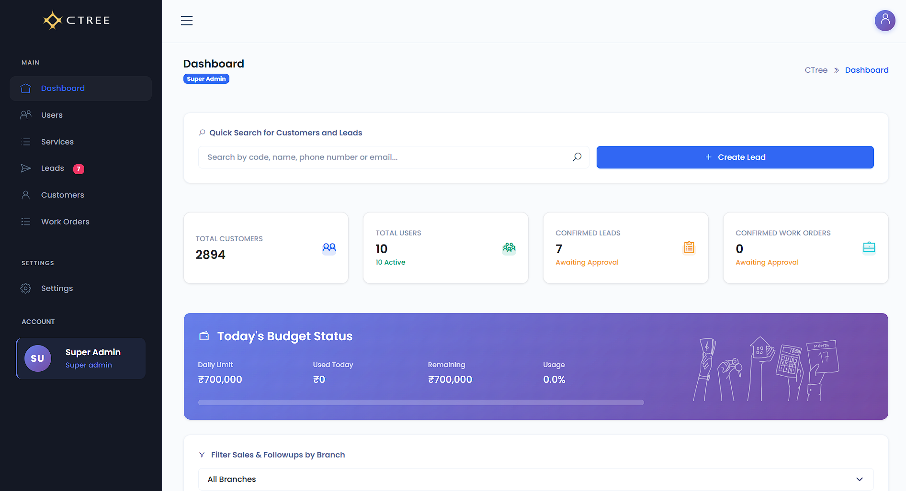
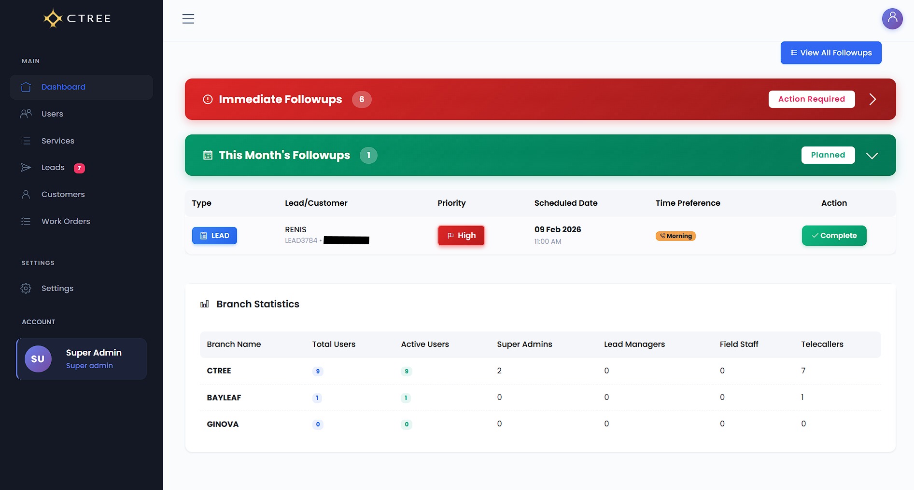
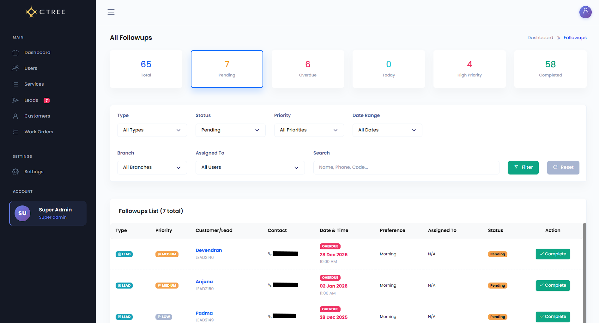
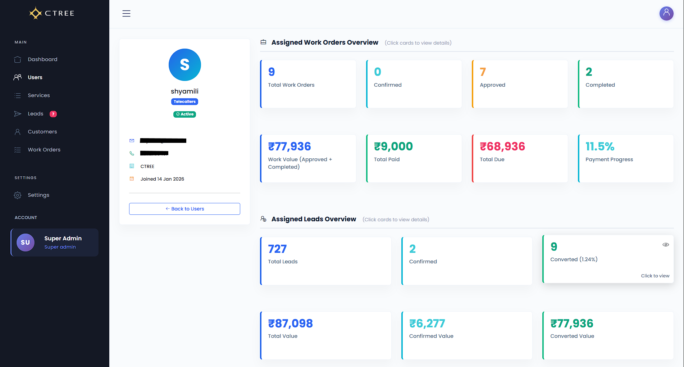
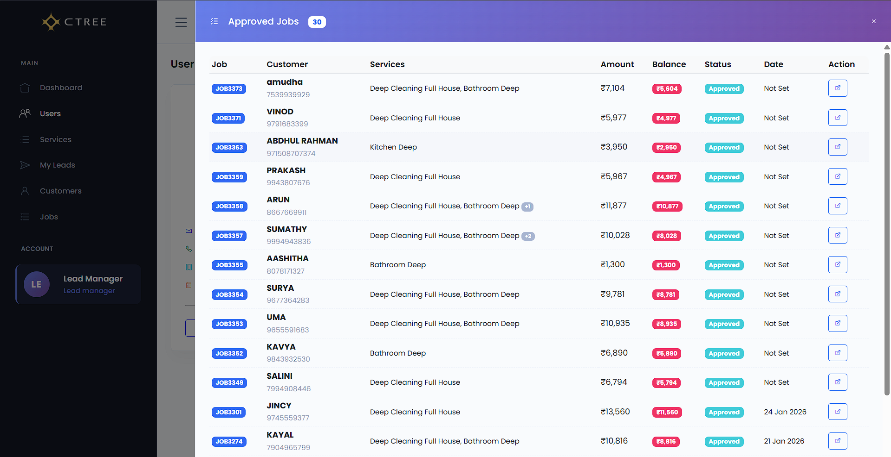
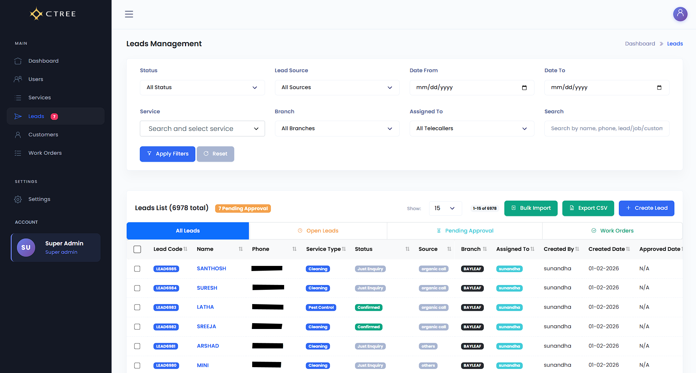

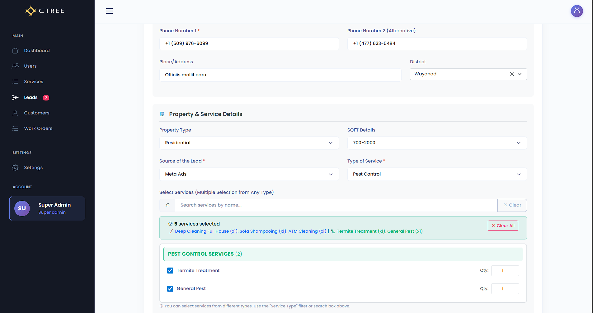

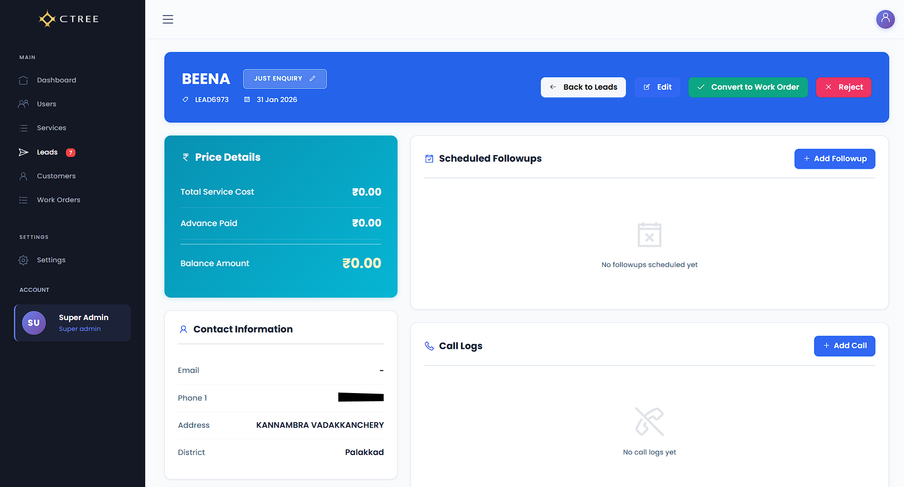
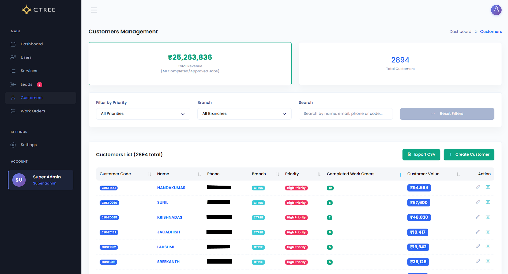
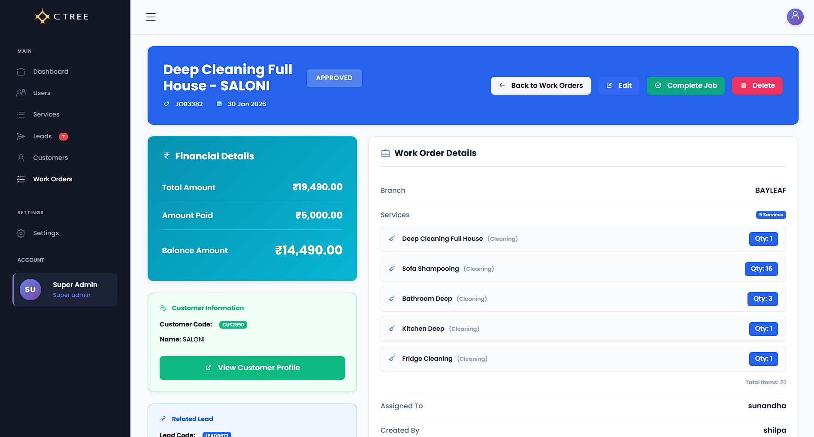
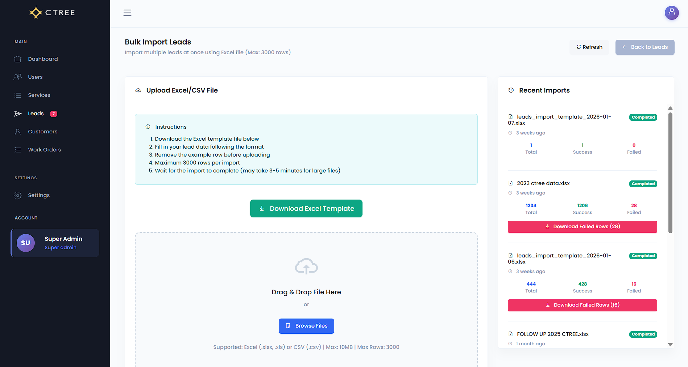

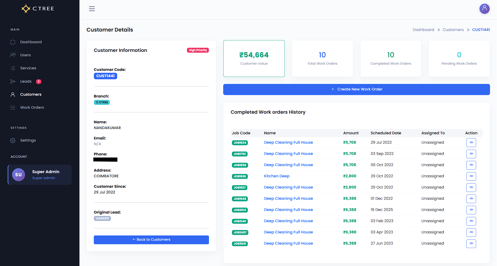
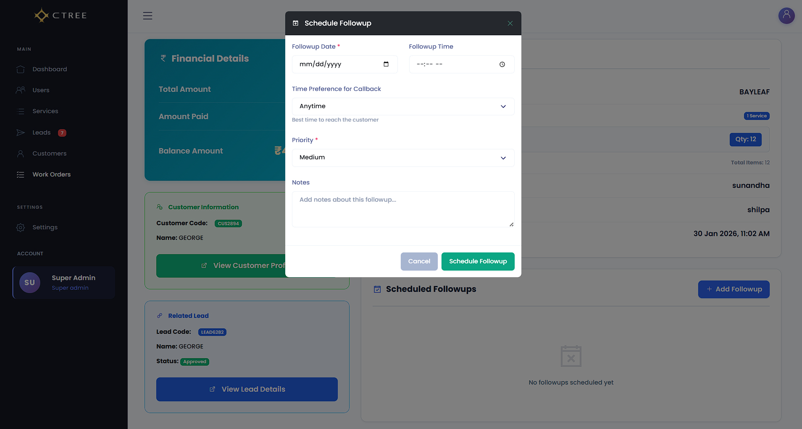
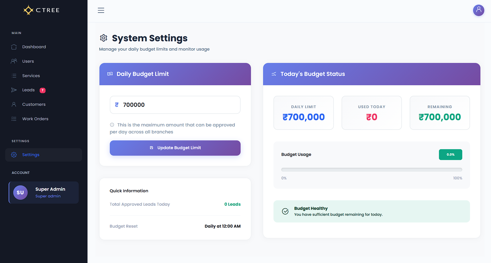
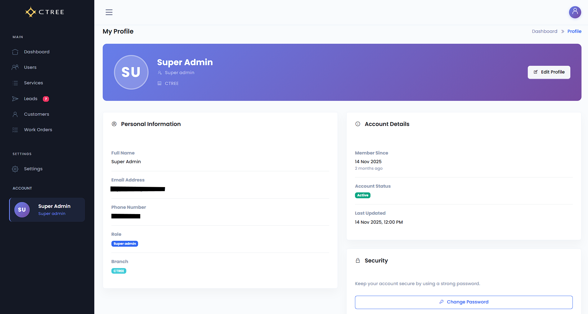

## Quick Start (Local)
- git clone <YOUR_REPO_URL>
- cd <YOUR_PROJECT_FOLDER>
- composer install
- cp .env.example .env
- php artisan key:generate
- php artisan migrate
- php artisan serve
